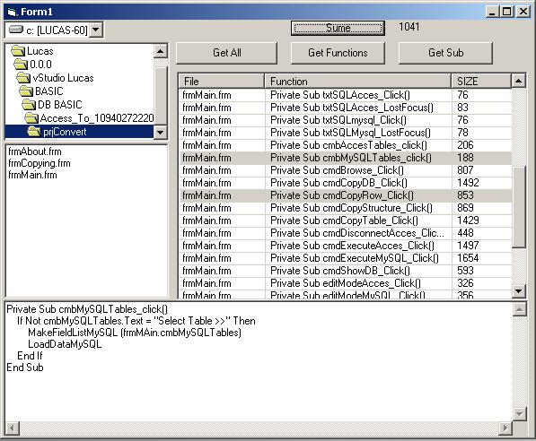



## Extractor of Function and Commands

### Description

Now Fix and Update !! 22-10-2002

Read all Function and Commands from the .frm. Select your directory where is yours .frm to see and click in GetAll (to get Function and Command).

Function and Command Code show with len.

Tanks to Robert Rayment for Fix
 
### More Info
 

             |
---                |---
**Submitted On**   |2002-10-22 12:37:38
**By**             |[Douglas Wiessel](https://github.com/Planet-Source-Code/PSCIndex/blob/master/ByAuthor/douglas-wiessel.md)
**Level**          |Intermediate
**User Rating**    |5.0 (10 globes from 2 users)
**Compatibility**  |VB 6\.0
**Category**       |[Debugging and Error Handling](https://github.com/Planet-Source-Code/PSCIndex/blob/master/ByCategory/debugging-and-error-handling__1-26.md)
**World**          |[Visual Basic](https://github.com/Planet-Source-Code/PSCIndex/blob/master/ByWorld/visual-basic.md)
**Archive File**   |[Extractor\_14855110222002\.zip](https://github.com/Planet-Source-Code/douglas-wiessel-extractor-of-function-and-commands__1-40042/archive/master.zip)

